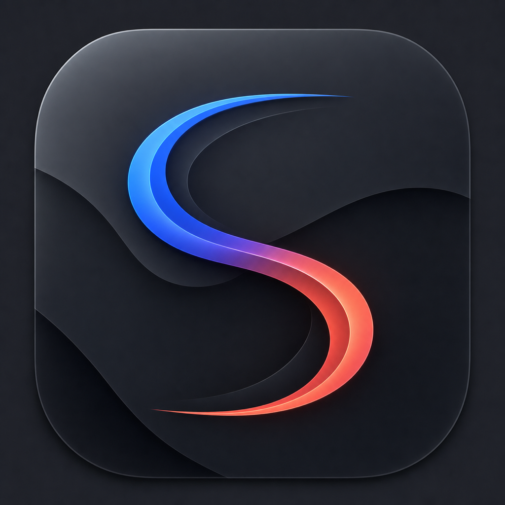

<p align="center">
  
</p>

<h1 align="center">Semper</h1>

<p align="center">
  <a href="https://github.com/niharnm/Semper/actions/workflows/ci.yml"></a>
  <a href="LICENSE"></a>
  <a href="https://github.com/niharnm/Semper/contribute"></a>
  <a href="https://github.com/niharnm/Semper/graphs/contributors"></a>
</p>

Native, per-application audio mixing and DSP engine for macOS. Semper resides in your menu bar, providing independent volume control, per-app output routing, ISO 226 equal-loudness contour compensation, AutoEQ headphone correction, and a Liquid Glass interface.

[semper.systems](https://semper.systems)

Semper is an open-source project founded and led by **Nihar Manchikakapudi**.

> [!IMPORTANT]
> **Contributors wanted.** Semper is looking for help with Swift, SwiftUI,
> Core Audio, DSP, device testing, accessibility, tests, and technical writing.
> Start on the [contribute page](https://github.com/niharnm/Semper/contribute)
> or read the [contributor guide](CONTRIBUTING.md).

## Release status

Semper does not have a packaged public release yet. The source, tests, and
build instructions are public. Signed and notarized downloads will appear on
[GitHub Releases](https://github.com/niharnm/Semper/releases) when they are
ready. Do not download a Semper DMG from an unofficial source.

## Architecture Highlights

- **Swift 6 & Core Audio TCC Taps**: Built using modern Swift 6 strict concurrency (`@MainActor`, `Sendable`) and low-latency CoreAudio process taps.
- **ISO 226 Equal-Loudness Compensation**: Dynamic frequency contour adjustment matching human psychoacoustics at varying volume levels.
- **Capability-Aware Audio Routing**: Per-application routing to independent output devices (e.g. video calls to AirPods, music to desktop monitors) with automatic hardware capability detection.
- **300% Device-Aware Gain & Peak Limiting**: Software master gain boosting up to 300% paired with a zero-latency peak soft limiter starting at -1 dBFS.
- **AutoEQ Engine**: 10-band parametric EQ supporting AutoEQ headphone profiles and custom user presets.
- **Liquid Glass Interface**: High-vibrancy macOS design system with dynamic Tahoe-style HUDs, balance controls, and menu bar interaction.

## Requirements

- macOS 15.4 or later
- Screen & System Audio Recording permission (required for CoreAudio process taps)
- Microphone permission (only for input-device monitoring)
- Accessibility permission (optional for system media-key control)

## Building from Source

```bash
git clone https://github.com/niharnm/Semper.git
cd Semper
open Semper.xcodeproj
```

Unsigned local Release build:

```bash
xcodebuild \
  -project Semper.xcodeproj \
  -scheme Semper \
  -configuration Release \
  -derivedDataPath ./build \
  CODE_SIGN_IDENTITY="" \
  CODE_SIGNING_REQUIRED=NO \
  CODE_SIGNING_ALLOWED=NO \
  build
```

The output binary is placed at `build/Build/Products/Release/Semper.app`.

## Documentation & Guides

- [URL Schemes](guide/url-schemes.md)
- [Experiments](guide/experiments.md)
- [AutoEQ Integration](guide/autoeq.md)
- [Canary Testing](guide/canary.md)
- [Troubleshooting](guide/troubleshooting.md)
- [Real-time Audio Safety](guide/realtime-audio-safety.md)
- [Contributing Guidelines](CONTRIBUTING.md)

## Contributing

External pull requests are welcome while Semper is still source-first.

- Pick a scoped task from [good first issues](https://github.com/niharnm/Semper/contribute)
  or [help wanted issues](https://github.com/niharnm/Semper/issues?q=is%3Aissue%20is%3Aopen%20label%3A%22help%20wanted%22).
- Read the [roadmap](ROADMAP.md) before proposing a larger feature.
- Use [GitHub Discussions](https://github.com/niharnm/Semper/discussions) for
  setup help, design questions, and early proposals.
- Follow [CONTRIBUTING.md](CONTRIBUTING.md) for setup, tests, audio-thread
  constraints, hardware reports, and pull-request expectations.

Documentation fixes, isolated tests, device reports, and accessibility work
are useful contributions. Changes to the real-time audio callback need focused
tests and a clear safety argument.

## Legal

- [Privacy Policy](PRIVACY.md)
- [Terms of Use](TERMS.md)

## License

Semper is distributed under the [GNU General Public License Version 3](LICENSE) (`GPL-3.0-only`).

Copyright (C) 2026 Nihar Manchikakapudi and contributors.
